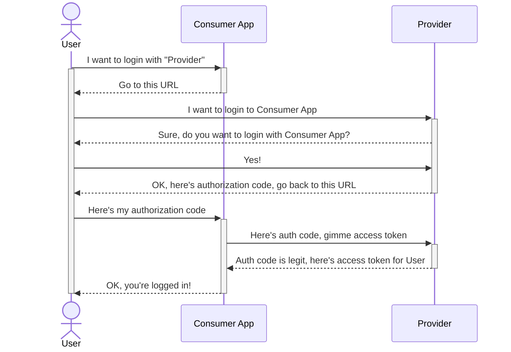
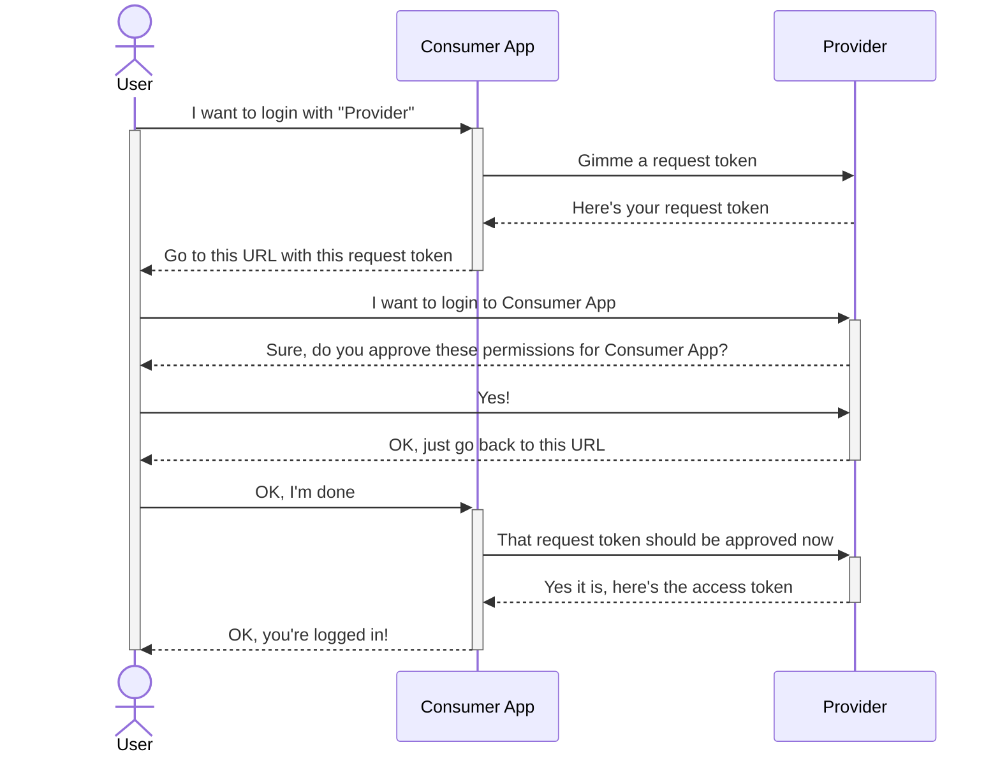

I've been using [Pocket](https://getpocket.com/) for quite some time and recently I've decided to build something on top of their API. And since Pocket's API is a bit dated and resources are scarce, I've collected my notes and thoughts on the API as a future reference for myself – perhaps it will be useful to you.

The first thing I needed to figure out was authentication. The good news is the authentication flow is [well documented](https://getpocket.com/developer/docs/authentication). The bad news is immediately in the first sentence:

> The Pocket Authentication API uses _a variant of OAuth 2.0_ for authentication.

(Emphasis mine.)

“Variant of OAuth 2.0” reeks of custom authentication schemes, which usually spells trouble. It turns out that while Pocket's authentication scheme is non-standard, it's actually closer to OAuth _1.0_ flow with “temporary credentials”. Minus all the requests signing characteristic for OAuth 1.0.

## Pocket authentication vs. OAuth 2.0 Authorization Code Flow

My simple understanding of a typical OAuth 2.0 Authorization Code Flow is this:



The consumer application identifies itself by the client ID. Provider also keeps a list of allowed callback URLs, so it's not possible to steal the authorization code by redirecting the user to a malicious app.

Pocket's authentication scheme is a bit different:



The consumer app asks for a request token (“temporary credentials”) at the beginning of the flow, which it later exchanges for an access token. It's sort of like getting a blank ticket and later validating it.

In the Authorization Code Flow, the provider adds the authorization code to the callback URL, so there's no need to store any state during the authorization. In case of Pocket's flow the request token needs to be stored somewhere, typically in a session or in a cookie.

On the other hand, Pocket doesn't need to know a list of allowed URLs. Even if the user were redirected to a malicious client app, it wouldn't know the original request token and couldn't exchange it for an access token.

The current version of Pocket API was [introduced in 2012](https://blog.getpocket.com/2012/11/introducing-the-new-pocket-api-for-developers-and-publishers/) which is the same year when OAuth 2.0 was finished. So I think the authentication scheme ended up somewhere in between OAuth 1.0 and 2.0: it's mostly OAuth 1.0 flow without requests signing, which was also removed in OAuth 2.0.

## Pocket authentication in Node.js

Since no API client tool like Postman or Hoppscotch can handle Pocket's authentication scheme, I had to implement it on my own.

Luckily, there are a few Node.js libraries handling the scheme, but most of them are over 5 years old. I've picked [pocket-auth](https://github.com/mheap/pocket-auth) by Michael Heap, and got my access token with this code modified from the library's example:

```js
const auth = require("pocket-auth");
const consumerKey = "<redacted>";
const redirectUri = "https://example.com";

async function main() {
  try {
    let code = await auth.fetchToken(consumerKey, redirectUri, {});
    let uri = auth.getRedirectUrl(code.code, redirectUri);
    console.log(
      "Visit the following URL and click approve in the next 10 seconds:"
    );
    console.log(uri);

    setTimeout(async function () {
      try {
        let r = await auth.getAccessToken(consumerKey, code.code);
        console.log(r);
      } catch (err) {
        console.error(err);
        console.log(
          "You didn't click the link and approve the application in time"
        );
      }
    }, 20000);
  } catch (err) {
    console.log(err);
  }
}

main();
```

The script will show an URL with the request token, and after 20 seconds it attempts to grab the access key – you need to authorize access to Pocket in the meantime.

Only later I've found that Michael also built a [CLI tool for pocket-auth](https://github.com/mheap/pocket-auth-cli), which is much more convenient. Just run the tool with consumer key as argument, and it will handle the whole flow.

```shell
$ npx pocket-auth-cli <Pocket consumer key>
Opening web browser to authorize application
Press CTRL+C to cancel
{ access_token: '<redacted>', username: '<redacted>' }
```

## Onto retrieval

This was a distracting but necessary step to get access to Pocket's API. Now it's time to retrieve some articles – but let's keep it for another time.
