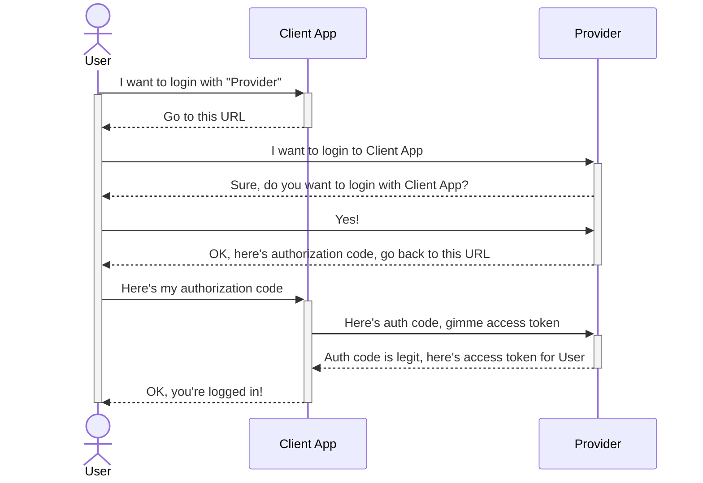
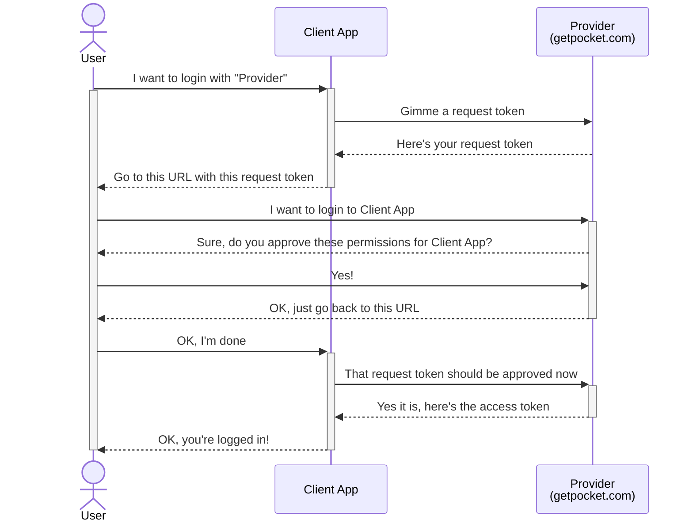

I've been using Pocket (getpocket.com) for quite some time and recently I've decided to build something on top of their API. And since Pocket's API is a bit dated and resources are scarce, I've collected my notes and thoughts on the API as a future reference for myself – perhaps it will be useful to you.

The first thing I needed to figure out was authentication. The good news is the authentication flow is [well documented](https://getpocket.com/developer/docs/authentication). The bad news is immediately in the first sentence:

> The Pocket Authentication API uses _a variant of OAuth 2.0_ for authentication.

(Emphasis mine.)

“Variant of OAuth 2.0” reeks of custom authentication schemes, which usually spells trouble. And while Pocket's authentication scheme is non-standard, it sort of makes sense.

## Pocket authentication vs. OAuth 2.0 Authorization Code Flow

My very simple understanding of a typical OAuth 2.0 Authorization Code Flow is this:

The client application identifies itself by the client ID. Provider also keeps a list of allowed callback URLs, so it's not possible to steal the authorization code by redirecting the user to a malicious app.

Pocket's authentication scheme is a bit different:

The client app asks for a request token at the beginning of the flow, which it later exchanges for an access token. It's sort of like getting a blank ticket and later validating it.

In the Authorization Code Flow, the provider adds the authorization code to the callback URL, so there's no need to store any state during the authorization. But since the request token is issued at the beginning of the flow, it needs to be stored somehow, in a session or in a cookie.

On the other hand, Pocket doesn't need to know a list of allowed URLs. Even if the user were redirected to a malicious client app, it wouldn't know the original request token and couldn't exchange it for access token.

I think the Pocket's authentication flow was designed with mobile applications in mind (“public clients” in OAuth 2.0 terms). There are no client secrets and the documentation goes into a great length to explain how to redirect the user to a mobile Pocket app for authorization if it's installed.

## Authentication flow in Node.js

